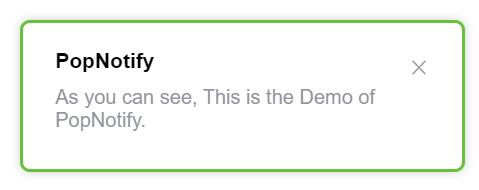

# PopNotify

仿 `Element UI` 的通知卡片。



## 🚀 开始使用

**从CDN引入**

> 查看[演示 Demo](https://ziuchen.github.io/PopNotify/demo/Demo.html)

```html
<!-- 引入 css -->
<link href="https://cdn.jsdelivr.net/gh/ZiuChen/PopNotify@main/dist/PopNotify.min.css" rel="stylesheet">

<!-- 引入 js -->
<script src="https://cdn.jsdelivr.net/gh/ZiuChen/PopNotify@main/dist/PopNotify.min.js"></script>

<script>
  const option = {
    title: "PopNotify",
    content: "As you can see, This is the Demo of PopNotify."
  }
  new PopNotify.notify(option)
<script>
```

## 📌 可选属性

| 属性                     | 说明                                        | 类型     | 可选值                                      | 默认值             |
| ------------------------ | ------------------------------------------- | -------- | ------------------------------------------- | ------------------ |
| title                    | 标题                                        | string   | —                                           | —                  |
| message                  | 通知栏正文内容                              | string   | —                                           | —                  |
| dangerouslyUseHTMLString | 是否将 message 属性作为 HTML 片段处理       | boolean  | —                                           | false              |
| type                     | 通知的类型                                  | string   | success/warning/info/error                  | —                  |
| customClass              | 自定义类名                                  | string   | —                                           | —                  |
| fadeTime                 | 显示时间, 单位为毫秒。值为 0 则不会自动关闭 | number   | —                                           | 4500               |
| position                 | 自定义弹出位置                              | string   | top-right/top-left/bottom-right/bottom-left | top-right          |
| showClose                | 是否显示关闭按钮                            | boolean  | —                                           | true               |
| onClose                  | 关闭时的回调函数                            | function | —                                           | —                  |
| onClick                  | 点击 Notification 时的回调函数              | function | —                                           | ()=>{this.close()} |
| offset                   | 相对屏幕顶部的偏移量                        | number   | —                                           | 0                  |

